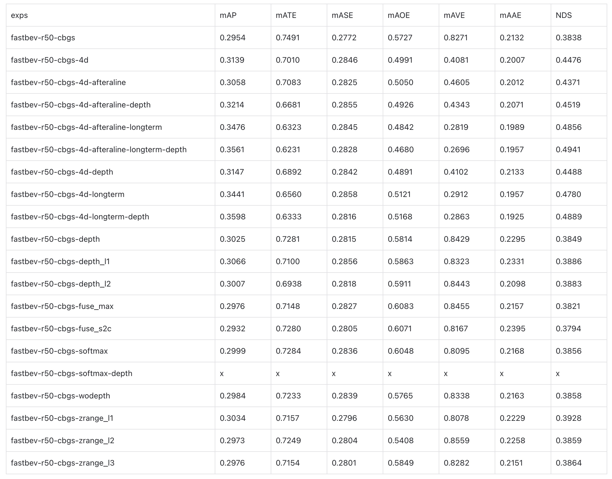
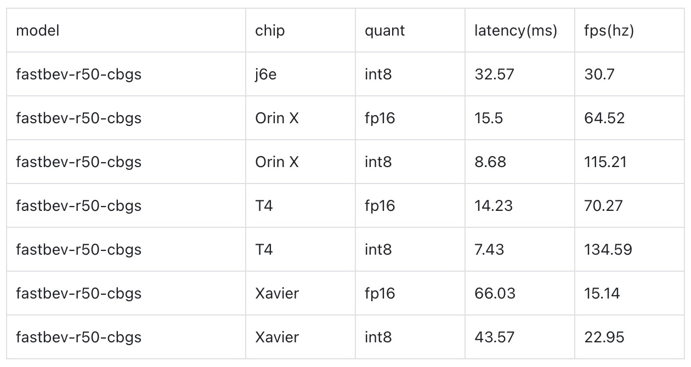

# FastBEV++

## Main Results



## Inference latency

#### Estimate the inference speed of BEVDet
```shell
# with acceleration
python tools/analysis_tools/benchmark.py configs/bevdet/bevdet-sttiny-accelerated.py $checkpoint
# without acceleration
python tools/analysis_tools/benchmark.py configs/bevdet/bevdet-sttiny.py $checkpoint
```
#### Estimate the flops of BEVDet
Note: For bevdet4d, the FLOP result involves the current frame only.  
```shell
python tools/analysis_tools/get_flops.py configs/bevdet/bevdet-sttiny.py --shape 256 704
python tools/analysis_tools/get_flops.py configs/bevdet4d/bevdet4d-sttiny.py --shape 256 704
```
#### Visualize the predicted result with open3d.
* Official implementation. (Visualization locally only)
```shell
python tools/test.py $config $checkpoint --show --show-dir $save-path
```
* Private implementation. (Visualization remotely/locally)
```shell
python tools/test.py $config $checkpoint --format-only --eval-options jsonfile_prefix=$savepath
python tools/analysis_tools/vis.py $savepath/pts_bbox/results_nusc.json
```
## Acknowledgement

This project is not possible without multiple great open-sourced code bases. We list some notable examples below.

- [open-mmlab](https://github.com/open-mmlab)
- [CenterPoint](https://github.com/tianweiy/CenterPoint)
- [Lift-Splat-Shoot](https://github.com/nv-tlabs/lift-splat-shoot)
- [Swin Transformer](https://github.com/microsoft/Swin-Transformer)
- [BEVFusion](https://github.com/mit-han-lab/bevfusion)
- [BEVDepth](https://github.com/Megvii-BaseDetection/BEVDepth)
- [BEVerse](https://github.com/zhangyp15/BEVerse)  for multi-task learning.
- [BEVStereo](https://github.com/Megvii-BaseDetection/BEVStereo)  for stero depth estimation.
- [BEVDet](https://github.com/HuangJunJie2017/BEVDet)
- [Fast-BEV](https://github.com/Sense-GVT/Fast-BEV)
